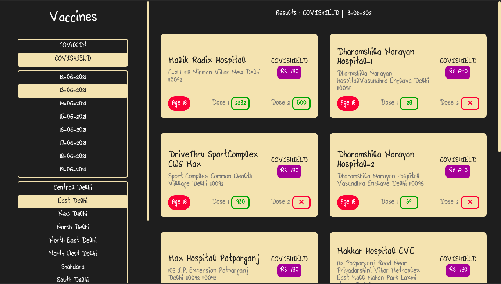
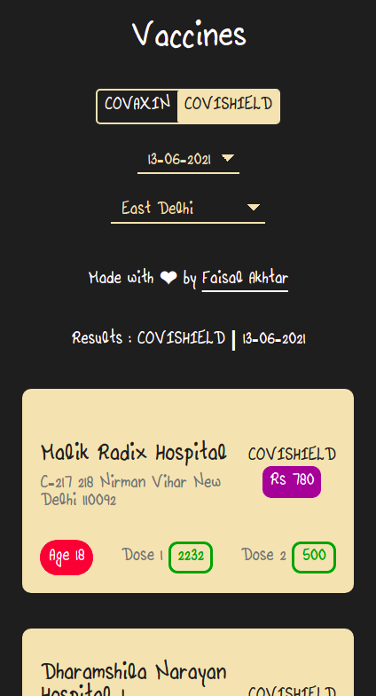

# Vaxinate

💉💉Locating vaccine in Delhi for me (and my bros)💉💉

### Backstory

This is a simple website that tracks and locates vaccines in Delhi (India) for me. I want to get vaccinated, but checking the website every 5 minutes was not possible, given I'd be waiting for weeks. So, I built this website where I had to do fewer steps to check for vaccine in my locality.

The quirky font, if you are wondering, is actually my sister's handwriting converted (poorly). We had a good laugh about it. (You have to know me a little bit to understand why I find such stupid things funny.)

## Screenshots

## Acknowledgements
- The API used is Govt of India's open API for public

## [License](LICENSE.md)