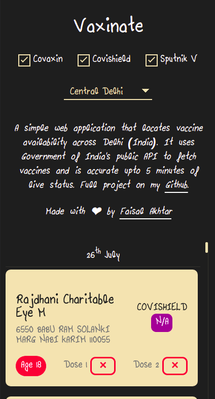

# Vaxinate

💉💉Locating vaccines in Delhi💉💉

### Backstory

A simple web application that locates vaccines in Delhi (India) for me. I want(ed) to get vaccinated, but checking the website every 5 minutes was not possible, given I'd be waiting for weeks. So, I built a bot to check for vaccines time-to-time and give me a heads-up when it gets one. This website was the first step to it, where I had to do a lot fewer steps to check for vaccines in my locality.

The quirky font, if you are wondering, is actually my sister's handwriting converted (poorly). We had a good laugh about it. (You have to know me a little bit to understand why I find such stupid things funny.)

## Screenshots

## Acknowledgements
- The API used is Govt of India's open API for public

## [License](LICENSE.md)